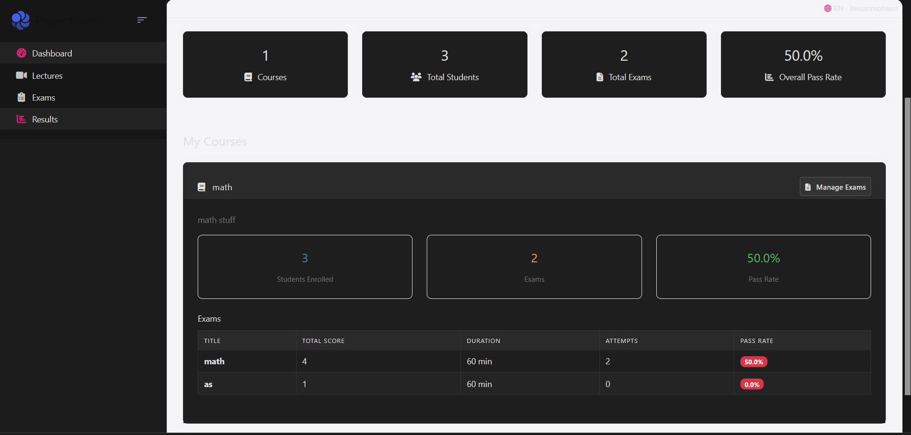
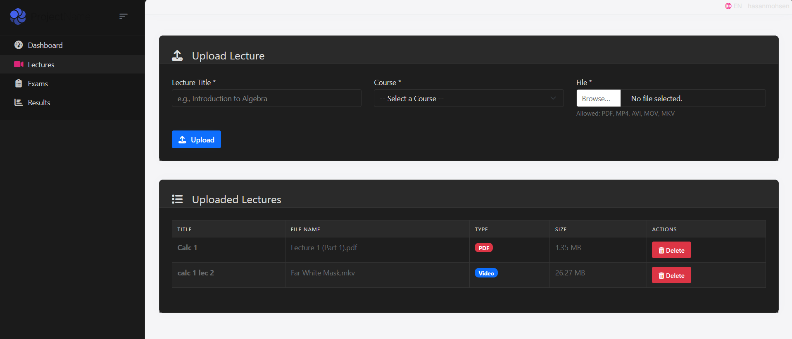
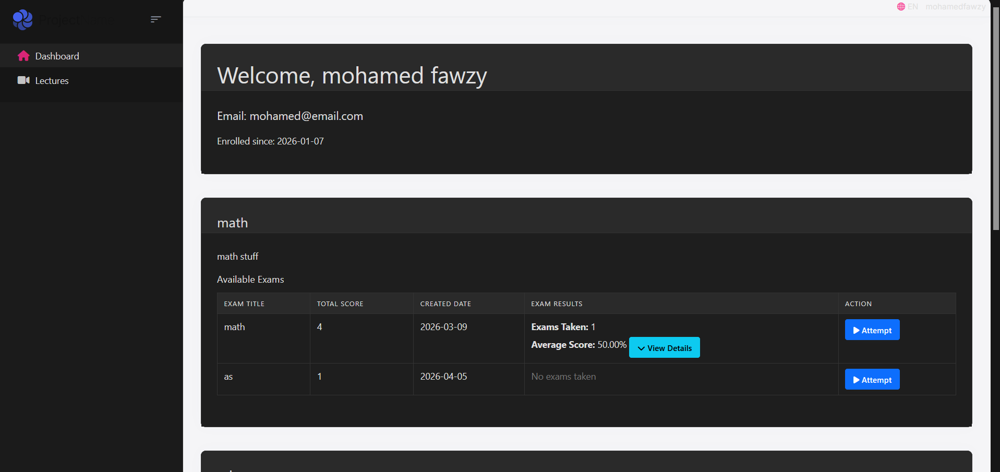

# ElearningSystem

A full-stack e-learning web application built with **ASP.NET Core MVC**, **ABP Framework**, and **Entity Framework Core**. The system supports three roles — Admin, Teacher, and Student — each with their own dedicated dashboard and features.

---

## Tech Stack

- **Framework:** ASP.NET Core MVC + ABP Framework
- **ORM:** Entity Framework Core
- **UI:** Razor Pages + Bootstrap 5 + Font Awesome
- **Auth:** ABP Identity (role-based)
- **Database:** SQL Server

---

## Roles

| Role | Description |
|------|-------------|
| Admin | Manages students, teachers, courses, and exams |
| Teacher | Uploads lectures, creates and manages exams, views student results |
| Student | Attempts exams, views results, downloads lectures |

---

## Features

### Admin
- Create, edit, and delete students and teachers
- Enroll students and teachers into courses
- Manage courses and exams
- View student exam results

### Teacher
- Personalized dashboard with course stats (enrolled students, exam count, pass rate)
- Upload PDF and video lectures per course
- Create and manage exams with question banks
- View student results filtered by course or exam

### Student
- Dashboard showing enrolled courses and available exams
- Attempt exams and view results with pass/fail breakdown
- Download lecture files (PDF and video) per course

---

## Screenshots

### Admin — Manage Students


---

### Teacher — Dashboard


---

### Teacher — Upload Lectures


---

### Teacher — Manage Exams


---

### Student — Dashboard


---

### Student — My Lectures


---

## Project Structure

```
ElearningSystem/
├── ElearningSystem.Application/        # Services and DTOs
├── ElearningSystem.Domain/             # Entities
├── ElearningSystem.EntityFrameworkCore/ # DbContext and migrations
└── ElearningSystem.Web/                # Razor Pages, Controllers, UI
    └── Pages/
        ├── Admin/        # Students, Teachers, Courses
        ├── Teacher/      # Dashboard, Lectures, Exams, Results
        ├── Student/      # Lectures
        └── Exams/        # Attempt, Create, Edit
```

---

## Entities

- `Student` — linked to ABP Identity user
- `Teacher` — linked to ABP Identity user
- `Course` — available courses in the system
- `StudentCourse` — many-to-many: student enrollments
- `TeacherCourse` — many-to-many: teacher assignments
- `Exam` — belongs to a course
- `Question` — belongs to a course
- `ExamQuestion` — many-to-many: questions in an exam
- `Answer` — belongs to a question
- `StudentExam` — student exam attempt result
- `Lecture` — file upload linked to a course and teacher

---

## Getting Started

### Prerequisites
- .NET 8 SDK
- SQL Server
- Visual Studio 2022

### Setup

1. Clone the repository
```bash
git clone https://github.com/yourusername/ElearningSystem.git
```

2. Update the connection string in `appsettings.json`

3. Run migrations
```bash
dotnet ef database update
```

4. Run the application
```bash
dotnet run
```

5. Log in with the default ABP admin account and start creating roles, teachers, and students from the Administration panel.

---

## License

This project is for educational purposes.
