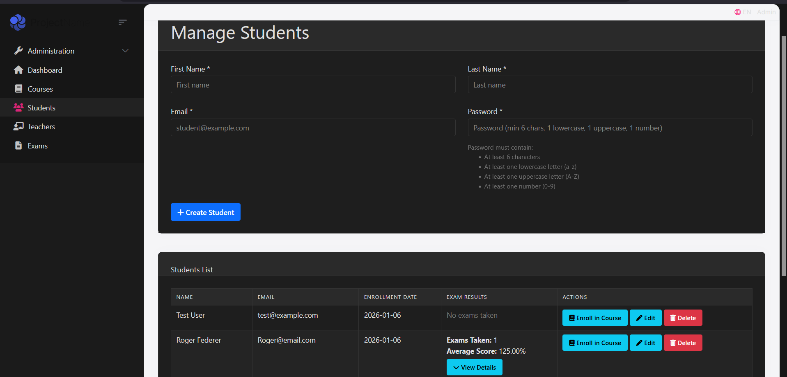
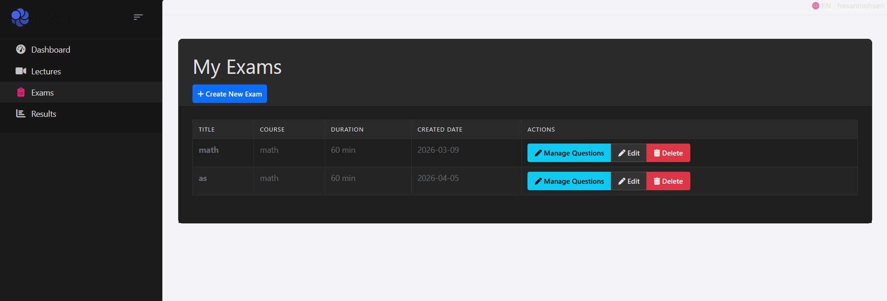
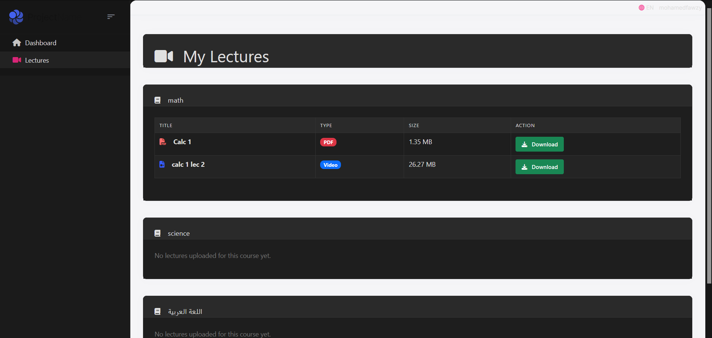

# ElearningSystem

A full-stack e-learning web application built with **ASP.NET Core MVC**, **ABP Framework**, and **Entity Framework Core**. The system supports three roles — Admin, Teacher, and Student — each with their own dedicated dashboard and features.

---

## Tech Stack

- **Framework:** ASP.NET Core MVC + ABP Framework
- **ORM:** Entity Framework Core
- **UI:** Razor Pages + Bootstrap 5 + Font Awesome
- **Auth:** ABP Identity (role-based)
- **Database:** SQL Server

---

## Roles

| Role | Description |
|------|-------------|
| Admin | Manages students, teachers, courses, and exams |
| Teacher | Uploads lectures, creates and manages exams, views student results |
| Student | Attempts exams, views results, downloads lectures |

---

## Features

### Admin
- Create, edit, and delete students and teachers
- Enroll students and teachers into courses
- Manage courses and exams
- View student exam results

### Teacher
- Personalized dashboard with course stats (enrolled students, exam count, pass rate)
- Upload PDF and video lectures per course
- Create and manage exams with question banks
- View student results filtered by course or exam

### Student
- Dashboard showing enrolled courses and available exams
- Attempt exams and view results with pass/fail breakdown
- Download lecture files (PDF and video) per course

---

## Screenshots

### Admin — Manage Students
The admin can create new students by filling in their name, email, and password. The students list below shows all registered students along with their enrollment date, exam results summary, and action buttons to enroll them in courses, edit their info, or delete them.



---

### Teacher — Dashboard
The teacher dashboard gives an overview of all assigned courses at a glance. The top cards show total courses, total enrolled students, total exams, and the overall pass rate across all courses. Each course card below shows per-course stats including students enrolled, number of exams, and pass rate, along with a breakdown table of each exam's attempts and pass rate.


---

### Teacher — Upload Lectures
Teachers can upload lecture files (PDF or video) for their assigned courses. Uploaded lectures are listed in a table showing the title, original file name, file type badge, and file size. Teachers can delete any lecture from this page.


---

### Teacher — Manage Exams
The teacher's exams page lists all exams belonging to their assigned courses. Each exam shows the title, course, duration, and creation date. Teachers can manage questions for each exam through a modal, edit exam details, or delete exams. New exams can be created using the Create New Exam button.



---

### Student — Dashboard
The student dashboard welcomes the logged-in student and shows all their enrolled courses. Under each course, available exams are listed with the total score, creation date, and the student's own results including how many times they attempted the exam and their average score. Students can expand a details panel to see individual attempt breakdowns, and attempt any exam directly from this page.


---

### Student — My Lectures
Students can view and download all lectures uploaded by teachers for their enrolled courses. Lectures are organized by course, with each entry showing the title, file type (PDF or Video), file size, and a download button. Courses with no lectures uploaded yet are shown with a placeholder message.



---

## Project Structure

```
ElearningSystem/
├── ElearningSystem.Application/        # Services and DTOs
├── ElearningSystem.Domain/             # Entities
├── ElearningSystem.EntityFrameworkCore/ # DbContext and migrations
└── ElearningSystem.Web/                # Razor Pages, Controllers, UI
    └── Pages/
        ├── Admin/        # Students, Teachers, Courses
        ├── Teacher/      # Dashboard, Lectures, Exams, Results
        ├── Student/      # Lectures
        └── Exams/        # Attempt, Create, Edit
```

---

## Entities

- `Student` — linked to ABP Identity user
- `Teacher` — linked to ABP Identity user
- `Course` — available courses in the system
- `StudentCourse` — many-to-many: student enrollments
- `TeacherCourse` — many-to-many: teacher assignments
- `Exam` — belongs to a course
- `Question` — belongs to a course
- `ExamQuestion` — many-to-many: questions in an exam
- `Answer` — belongs to a question
- `StudentExam` — student exam attempt result
- `Lecture` — file upload linked to a course and teacher

---

## Getting Started

### Prerequisites
- .NET 8 SDK
- SQL Server
- Visual Studio 2022

### Setup

1. Clone the repository
```bash
git clone https://github.com/yourusername/ElearningSystem.git
```

2. Update the connection string in `appsettings.json`

3. Run migrations
```bash
dotnet ef database update
```

4. Run the application
```bash
dotnet run
```

5. Log in with the default ABP admin account and start creating roles, teachers, and students from the Administration panel.

---

## License

This project is for educational purposes.
